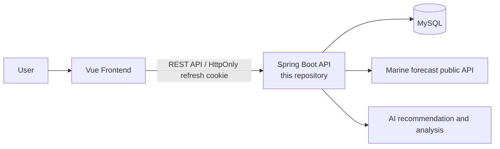

# Badamoyeo API

> **Team project · Spring Boot backend**
>
> 바다모여는 해양 예보 데이터를 바탕으로 사용자가 활동 목적에 맞는 장소를 탐색하고, 예보·커뮤니티·즐겨찾기·AI 추천 기능을 이용할 수 있도록 만든 서비스입니다. 이 저장소는 팀 프로젝트의 백엔드 API 구현을 다룹니다.

## 프로젝트 연결

- 전체 팀 프로젝트 원본 (프론트엔드·백엔드·설계 문서): <https://lab.ssafy.com/pjy008008/pjn_final_d4_t05>
- 프론트엔드: <https://github.com/commoner-choi/bada-front>
- 백엔드: 이 저장소

프론트엔드 저장소는 서비스 전체 흐름을 확인하기 위한 팀 구성 요소입니다. 이 저장소에서는 Spring Boot 기반 API와 데이터 처리 구현에 집중합니다.

## 시스템 흐름



바다모여 서비스의 Spring Boot 백엔드 API입니다. 해양 예보 공공데이터를 수집하고, 대시보드/스팟/게시글/댓글/즐겨찾기/사용자 인증 API를 제공합니다.

## 기술 스택

- Java 21
- Spring Boot 4
- Spring Security
- MyBatis
- MySQL
- Gradle

## 실행 준비

MySQL 데이터베이스를 준비한 뒤 `docs/schema.sql`을 실행해 테이블을 생성합니다.

```bash
mysql -u {user} -p {database} < docs/schema.sql
```

로컬 기본값은 아래와 같습니다.

```properties
DB_URL=jdbc:mysql://127.0.0.1:3306/badamoyeo?serverTimezone=Asia/Seoul&characterEncoding=UTF-8
DB_USERNAME=ssafy
DB_PASSWORD=ssafy
```

## 환경변수

필요한 값은 실행 환경에서 직접 설정합니다. 비밀값은 Git에 올리지 않습니다.

```bash
DB_URL=...
DB_USERNAME=...
DB_PASSWORD=...
JWT_SECRET=...
OPENAPI_MARINE_SERVICE_KEY=...
CORS_ALLOWED_ORIGINS=http://localhost:5173
```

AI 챗봇을 사용할 경우 아래 값도 설정합니다. 설정하지 않으면 서버는 정상 실행되고 챗봇 API만 `503 Service Unavailable`을 반환합니다.

```bash
OPENAI_API_KEY=...
GMS_RESPONSES_URL=https://gms.ssafy.io/gmsapi/api.openai.com/v1/responses
```

SSAFY에서 발급받은 GMS Key를 `OPENAI_API_KEY`에 설정합니다.
GMS는 OpenAI Chat Completions가 아니라 문서에 안내된 Responses API를 사용하므로
기본 요청 주소는 `https://gms.ssafy.io/gmsapi/api.openai.com/v1/responses`입니다.
챗봇, 메인 추천, 상세 분석 모델은 모두 `gpt-5-mini`로 고정되어 있습니다.

OAuth를 사용할 경우 아래 값도 설정합니다.

```bash
GOOGLE_OAUTH_CLIENT_ID=...
GOOGLE_OAUTH_CLIENT_SECRET=...
KAKAO_OAUTH_CLIENT_ID=...
KAKAO_OAUTH_CLIENT_SECRET=...
NAVER_OAUTH_CLIENT_ID=...
NAVER_OAUTH_CLIENT_SECRET=...
```

운영 HTTPS 환경에서는 refresh token cookie 보안을 위해 아래 값을 권장합니다.

```bash
REFRESH_TOKEN_COOKIE_SECURE=true
```

## 실행

```bash
./gradlew bootRun
```

서버 기본 주소는 아래와 같습니다.

```text
http://localhost:8080
```

## AI 챗봇

로그인 후 access token을 포함해 챗봇 응답 리소스를 생성합니다.

```http
POST /ai/chat-completions
Authorization: Bearer {accessToken}
Content-Type: application/json

{
  "message": "이번 주말에 서핑하기 좋은 조건을 알려줘"
}
```

응답:

```json
{
  "content": "서핑 장소를 고를 때는 파고, 풍속, 수온을 함께 확인하세요.",
  "createdAt": "2026-06-22T12:00:00Z"
}
```

장소 추천·비추천 질문에는 Spring AI Tool Calling으로 `spots`와 `marine_forecasts`를 먼저 조회합니다.
AI는 DB에 저장된 장소와 가장 가까운 날짜의 예보만 근거로 답하며, 응답에 데이터 기준일을 포함하도록 설정되어 있습니다.

## 메인 AI 장소 추천

해양 예보 스케줄 수집이 성공하면 각 `체험 종류 + 예보 날짜` 조합별 후보 장소를
AI가 평가해 최대 6곳을 저장합니다.
장소별 해당 날짜의 오전·오후·일 예보 전체를 함께 전달해 하루 조건을 종합 평가합니다.
AI 호출이나 결과 검증이 실패하면 기존 추천은 유지됩니다.
서버 시작 시에는 이미 추천이 존재하는 체험·예보일 조합은 AI를 다시 호출하지 않으며,
정기 스케줄 수집 때도 추천이 없는 체험·예보일 조합만 생성합니다.
추천 모델은 크레딧 절약을 위해 `gpt-5-mini`로 고정되어 있습니다.

기존 DB에는 먼저 아래 마이그레이션을 적용합니다.

```bash
mysql -u {user} -p {database} < docs/ai-recommendations.sql
```

AI 추천은 기존 카드 조회 API에 `sort=ai`를 전달해 조회합니다.

```http
GET /dashboard?experience=surfing&targetDate=2026-06-23&sort=ai&limit=6
```

기존 카드 필드는 그대로 반환되며, AI 정렬일 때 각 카드에 `aiReason`이 추가됩니다.
조회 과정에서는 저장된 추천을 사용하므로 AI 크레딧이 소비되지 않습니다.

## 장소별 전체 시간대 예보

장소 목록, 대시보드 카드, 즐겨찾기 장소 목록, 장소 상세 응답에는 선택 날짜의
모든 시간대 예보가 `forecasts` 배열로 포함됩니다.
장소 상세 조회에서는 저장된 최신 AI 분석이 있는 예보에만 `aiAnalysis`를 포함합니다.
저장된 분석이 없거나 원본 예보가 갱신된 경우에는 상세 조회 속도를 위해 `aiAnalysis`를 `null`로 반환합니다.

```json
{
  "spotId": 247,
  "spotName": "중문색달해수욕장",
  "forecastDate": "2026-06-17",
  "forecasts": [
    {
      "forecastId": 3025,
      "timeSlot": "오전",
      "totalIndex": "보통",
      "metrics": {}
    },
    {
      "forecastId": 3028,
      "timeSlot": "오후",
      "totalIndex": "보통",
      "metrics": {}
    }
  ]
}
```

예보 관련 값은 중복 없이 `forecasts` 배열 안에서 시간대별로 제공합니다.

지도 마커와 즐겨찾기 장소 목록은 프런트에서 선택한 시간대만 조회할 수 있습니다.

```http
GET /dashboard/markers?experience=seaTravel&targetDate=2026-06-23&timeSlot=오전
GET /users/me/favorite-spots?targetDate=2026-06-23&timeSlot=오후&page=1&pageSize=20
```

`timeSlot` 허용값은 `오전`, `오후`, `일`이며 생략하면 해당 날짜의 전체 시간대 예보를 반환합니다.

## 상세페이지 AI 분석

상세페이지에서 분석이 필요한 장소·예보만 별도 AI 분석 API로 요청해 `gpt-5-mini`로 분석하고 DB에 저장합니다.
같은 예보가 다시 요청되면 저장된 결과를 반환하며, 해당 예보 행의 `updated_at`이 변경된 경우에만 다시 생성합니다.
AI 입력에는 정제된 `metrics`, 종합지수, 날씨, 물때만 사용하고 `rawData`는 제외합니다.

```http
GET /spots/{spotId}/ai-analysis
GET /spots/{spotId}/ai-analysis?targetDate=2026-06-23
```

AI 분석 API 응답에는 `recommended`와 1문장으로 작성된 `recommendationReason`이 포함됩니다.
이후 상세 조회에서는 저장된 최신 분석만 각 시간대 `aiAnalysis`에 포함됩니다.

## 테스트

```bash
./gradlew test
```

## 인증 방식

로그인과 회원가입 응답 body에는 `accessToken`이 내려갑니다. 프론트엔드는 이후 요청에 아래 헤더를 보냅니다.

```http
Authorization: Bearer {accessToken}
```

`refreshToken`은 JSON body에 노출하지 않고 `HttpOnly` cookie로 전달합니다. refresh/logout 요청은 cookie를 사용하므로 프론트엔드에서 credentials 설정이 필요합니다.

```js
fetch("/auth/refresh", {
  method: "POST",
  credentials: "include"
});
```

## 해양 예보 수집

아래 6개 경험치 데이터를 공공 API에서 수집합니다.

- `seaTravel`
- `swimming`
- `mudflat`
- `scuba`
- `fishing`
- `surfing`

서버 시작 시 수집이 실행되도록 설정되어 있습니다.

```properties
openapi.marine.ingestion.enabled=true
openapi.marine.ingestion.run-on-startup=true
```

공공 API가 간헐적으로 `UNKNOWN_ERROR`를 반환할 수 있어 수집 로직은 큰 페이지부터 빠르게 요청하고, 실패한 구간만 작은 페이지로 나누어 재시도합니다.

```text
300 -> 100 -> 50 -> 10
```

각 단계는 최대 3번 재시도합니다. 한 경험치 수집이 끝까지 실패해도 다음 경험치 수집은 계속 진행됩니다.

관리자 수동 수집 API:

```http
POST /admin/ingest/marine-forecasts
```

## DB 문서

- `docs/schema.sql`: 신규 DB 생성용 스키마
- `docs/ingestion-optimization.sql`: 기존 DB 보정용 SQL

## Postman

Postman 컬렉션을 공유할 경우 `docs/postman/` 아래에 두는 것을 권장합니다.

권장 환경 변수:

```text
baseUrl=http://localhost:8080
accessToken=
spotId=76
postId=1
commentId=1
provider=google
```

컬렉션 또는 환경 파일에는 access token, refresh token, API key 같은 비밀값을 저장하지 않습니다.

## Git에 올리지 않는 파일

아래 파일은 로컬 실행 산출물이거나 비밀값을 포함할 수 있어 Git에 올리지 않습니다.

```text
build/
.gradle/
.idea/
uploads/
.env
.env.*
```
